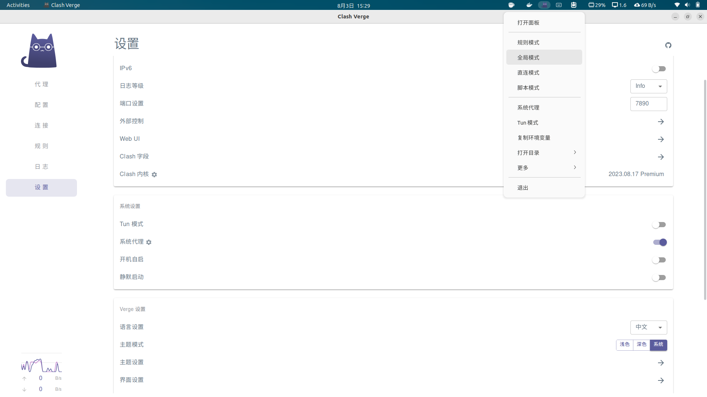
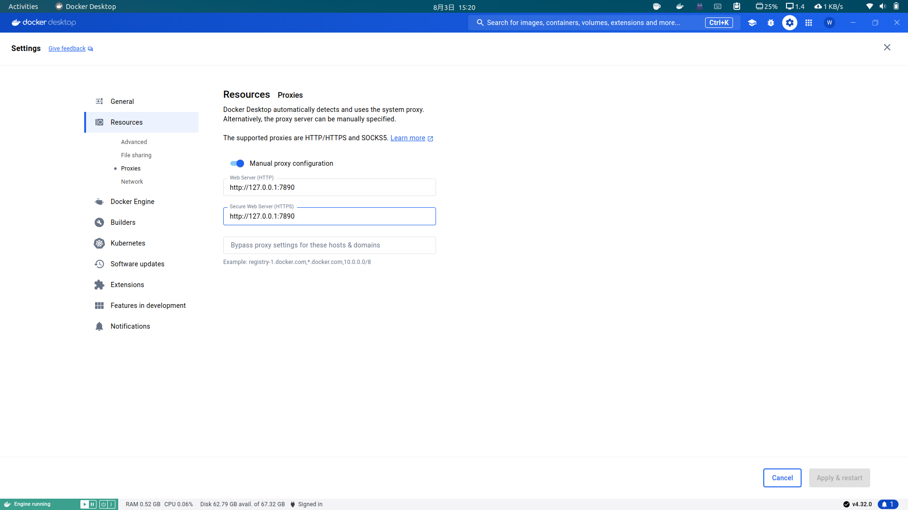

# Docker

## Install Docker Desktop

[https://docs.docker.com/desktop/install/linux-install/](https://docs.docker.com/desktop/install/linux-install/)

[https://docs.docker.com/desktop/install/ubuntu/#install-docker-desktop](https://docs.docker.com/desktop/install/ubuntu/#install-docker-desktop)

1. Set up Docker's package repository. See step one of [Install using theaptrepository](https://docs.docker.com/engine/install/ubuntu/#install-using-the-repository).

```shell
# Add Docker's official GPG key:
sudo apt-get update
sudo apt-get install ca-certificates curl
sudo install -m 0755 -d /etc/apt/keyrings
# sudo curl -fsSL https://download.docker.com/linux/ubuntu/gpg -o /etc/apt/keyrings/docker.asc // [!code --]
sudo curl -fsSL https://mirrors.ustc.edu.cn/docker-ce/linux/ubuntu/gpg -o /etc/apt/keyrings/docker.asc
sudo chmod a+r /etc/apt/keyrings/docker.asc

Add the repository to Apt sources:
# echo \ // [!code --]
#   "deb [arch=$(dpkg --print-architecture) signed-by=/etc/apt/keyrings/docker.asc] https://download.docker.com/linux/ubuntu \ // [!code --]
#   $(. /etc/os-release && echo "$VERSION_CODENAME") stable" | \ // [!code --]
#   sudo tee /etc/apt/sources.list.d/docker.list > /dev/null // [!code --]
echo \
  "deb [arch=$(dpkg --print-architecture) signed-by=/etc/apt/keyrings/docker.asc] https://mirrors.ustc.edu.cn/docker-ce/linux/ubuntu \
  $(. /etc/os-release && echo "$VERSION_CODENAME") stable" | \
  sudo tee /etc/apt/sources.list.d/docker.list > /dev/null
sudo apt-get update
```

**bugfix**

[Docker安装遇到问题：curl: (7) Failed to connect to download.docker.com port 443: 拒绝连接-CSDN博客](https://blog.csdn.net/Fengdf666/article/details/140221138)

2. Download [latest DEB package](https://desktop.docker.com/linux/main/amd64/docker-desktop-amd64.deb?utm_source=docker&utm_medium=webreferral&utm_campaign=docs-driven-download-linux-amd64&_gl=1*1bdcvx9*_gcl_aw*R0NMLjE3MjI2NTQzODYuRUFJYUlRb2JDaE1JM2NLTDB1dlhod01WM2x3UEFoMTlhQUNLRUFBWUFTQUFFZ0kxQWZEX0J3RQ..*_gcl_au*MTA5NDI0NzA4NC4xNzIyNjA0OTYx*_ga*OTY4MDY2MzUzLjE3MjI2MDQ5NjE.*_ga_XJWPQMJYHQ*MTcyMjY2Njc4OC40LjEuMTcyMjY2ODk2MS41OS4wLjA.).

3. Install the package with apt as follows:

```shell
sudo apt-get update
sudo apt-get install ./docker-desktop-<arch>.deb
```

### Proxy Config

代理软件打开全局模式



在 Docker Desktop 中设置代理软件端口



## Docker Container

### docker container commit

Create a new image from a container's changes.

[docker container commit](https://docs.docker.com/reference/cli/docker/container/commit/)

## Dockerfile

### ARG

set DEBIAN=noninteractive is very useful, and don't work in final image.

### ENV

without env, I should source .zshrc/.bashrc/.profile etc in every layer including container start