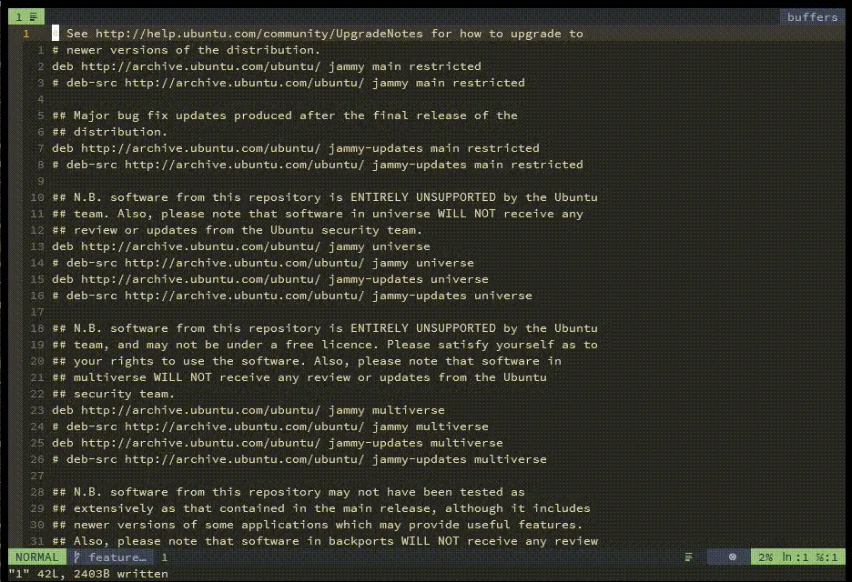
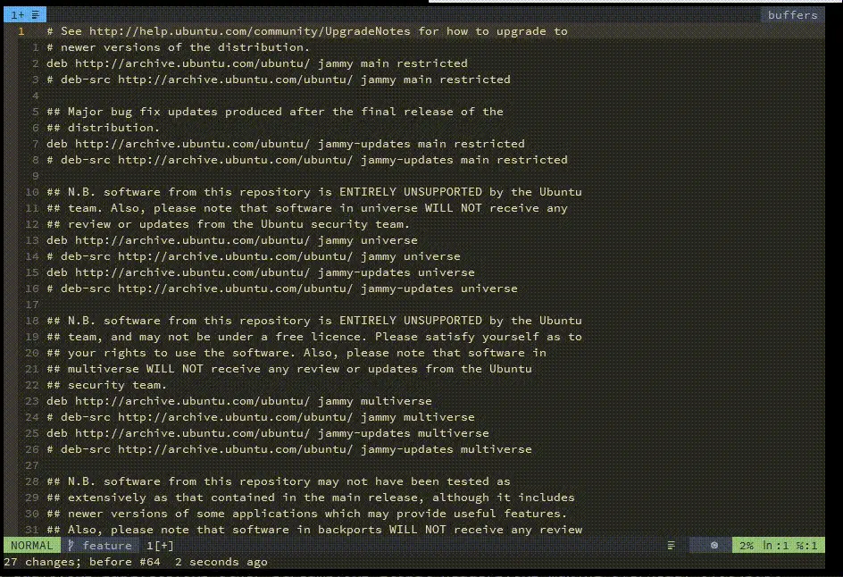
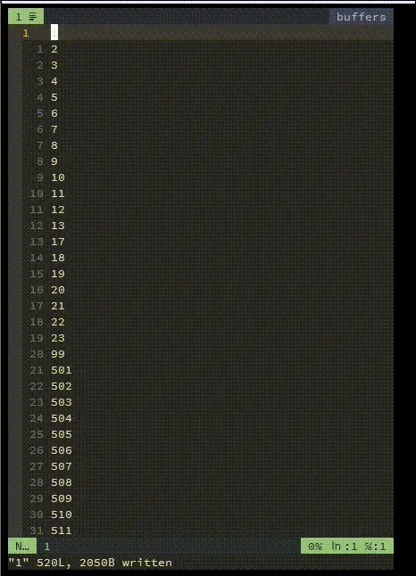

# Vim and Neovim

## Install

[环境配置指南/编辑器 – Neovim 安装配置教程（基于 NvChad）](https://zhuanlan.zhihu.com/p/712125953)

## Plugins

## Tricks

### Useful links

[awesome-cheatsheets/editors/vim.txt](https://github.com/skywind3000/awesome-cheatsheets/blob/master/editors/vim.txt)

[Vim 有什么奇技淫巧？](https://www.zhihu.com/question/27478597/answer/2777381978)

### Global command

> global命y令，是vim最重要的功能，一定要学会其操作，如上，也可以先查再操作(具体自己下去看), 这里给两个示例，1(删除文中#开头的行), 2(将所有#开头的行移动到底部）





### Text editing

#### Scope editing

```txt
$                   到行末
0                   到行首
^                   到行首非空字符
tx                  光标位置到字符 x 之前
fx                  光标位置到字符 x 之处
iw                  整个单词（不包括分隔符）
aw                  整个单词（包括分隔符）
iW                  整个 WORD（不包括分隔符）
aW                  整个 WORD（包括分隔符）
is                  整个句子（不包括分隔符）
as                  整个句子（包括分隔符）
ip                  整个段落（不包括前后空白行）
ap                  整个段落（包括前后空白行）
ib                  小括号内
ab                  小括号内（包含小括号本身）
iB                  大括号内
aB                  大括号内（包含大括号本身）
i)                  小括号内
a)                  小括号内（包含小括号本身）
i]                  中括号内
a]                  中括号内（包含中括号本身）
i}                  大括号内
a}                  大括号内（包含大括号本身）
i'                  单引号内
a'                  单引号内（包含单引号本身）
i"                  双引号内
a"                  双引号内（包含双引号本身）
2i)                 往外两层小括号内
2a)                 往外两层小括号内（包含小括号本身）
2f)                 到第二个小括号处
2t)                 到第二个小括号前
```

> 懂得范围的使用，比如你用过 `ciw`, `c$`, 你有想过用 `c/main` 吗？

`cfx` is also useful.

Use `dap` to delete paragraphs, which can be preceded by a number.

### Find & Replace

> 替换操作没必要一次操作成功，我们可以先找自己想要的，没问题再进行替换, 先使用/进行搜索，搜索正确后，替换操作的第一操作数可以省略。



`%s` means current file

> 20. 替换操作如果需要用到搜到的词，用&代替搜到的单词，就不用再次输入了。比如把变量换成MetadataReader变成v_MetadataReader。


> 21. 如何同时搜索两个单词呢？比如good和bad，配合20技巧，将这些单词后加上_select。


